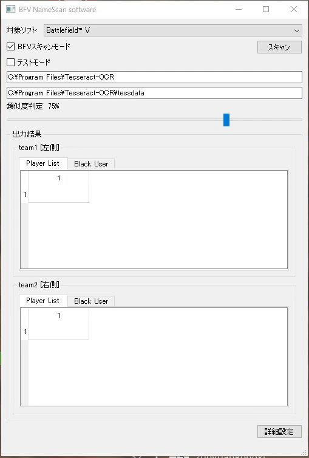
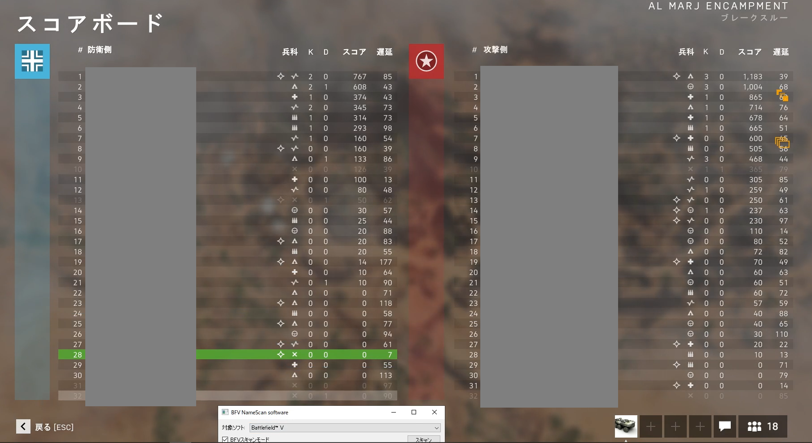
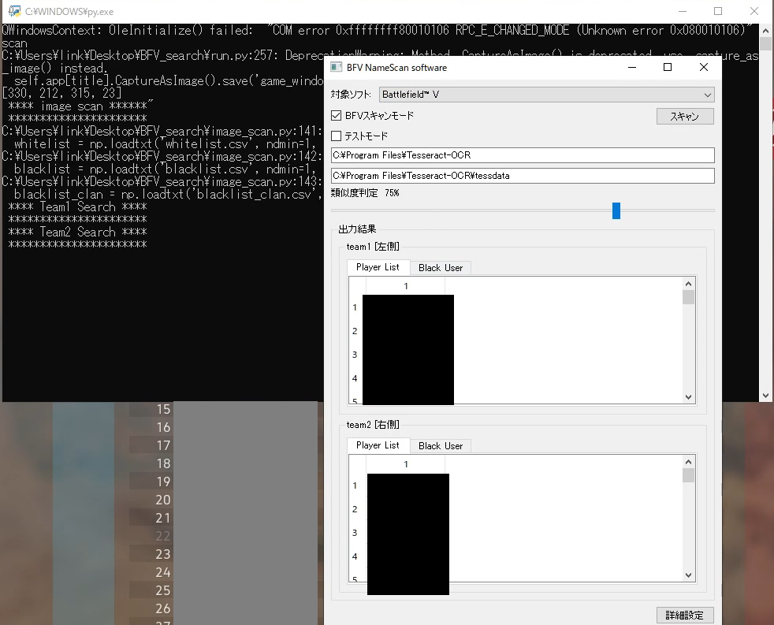

# 報告
このツールの上位互換にあたるツールを作りました。

こちらを使うのではなく、[「BFV_ServerOCR」](https://github.com/link1345/BFV_ServerOCR)を使ってください。

# BFV search
BFVと呼ばれるゲームにおいて、サーバに参加しているユーザ名を取得するツールです。

名前は、OCRで取得しています。


想定使用対象者は、サーバの管理者です。

BAN情報を保持しておきたいという要望に応えて、作ったツールになります。

## 機能
+ サーバ参加者のユーザ名取得
+ ブラックリストとのユーザ名の比較・表示

# install 

## python & pip
python vesion 3.8.6推奨

```
winget install Python.Python -v 3.8.6
py -m pip install --upgrade pip
py -m pip install Image pyocr opencv-python numpy pywinauto PyQt5
```

## tesseract
https://qiita.com/henjiganai/items/7a5e871f652b32b41a18
を参考。

https://tesseract-ocr.github.io/tessdoc/Home.html
の一番したにwindow用exeへのリンクがある。
https://github.com/UB-Mannheim/tesseract/wiki に行くと思うので、

「tesseract-ocr-w64-setup-v5.0.0-alpha.20200328.exe (64 bit) resp.」とか
という感じで書いてあるので、クリックしてダウンロードする。

あとは、適当にインストール。
途中でAdditional langage dataとか聞かれる。
今回は英語のみ入れておく。


# 使い方


## 1.ソフト起動
run.pyを起動させる。
pythonをインストールした段階で、GUI上でrun.pyをクリックするだけで、使用できるようになっているはずです。

## 2.キャプチャ先ソフトを選択
ソフト上部に「対象ソフト:」という項目があるので、「Battlefield™ V」を選択する。

## 3.参加ゲーム内のスコアボードを開き、スキャンする


この際、画面上にソフトが入らないようにしてください。
キャプチャの際に、ソフトが映ってしまいます。

## 4.出力を確認する


画像から取得できた内容を確認します。
事前にblacklist.csvやblacklist_clan.csvに登録した名前と類似しているユーザが、「Black User」に表示されます。

## 5.名前をコピーする

表を選択、右クリックで「copy」というボタンが出てくるので、クリックすると、グリップボードに保存されます。

# Black listを書き換える

## ユーザ名別
blacklist.csvにおいて、ユーザ別に改行を入れて保存すると、ツール内の「Black User」に表示されます。
``` 
hoge1
hoge2
```

## クラン名別
blacklist_clan.csvにおいて、クラン別のヒットも行えます。ゲーム内表示では「[hogeclan1]testuser」とある場合、下記のblacklist_clan.csvにヒットするため、ツール内の「Black User」に表示されます。
```
hogeclan1
hogeclan2
```

 # License
English : This software is released under the MIT License, see LICENSE.  
日本語 : このソフトウェアは、MITライセンスの下でリリースされています。ライセンスを参照してください。  


